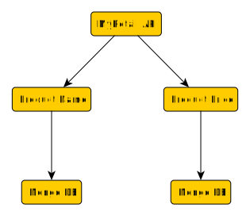
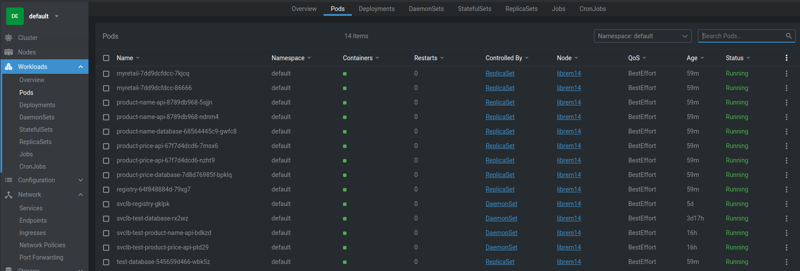
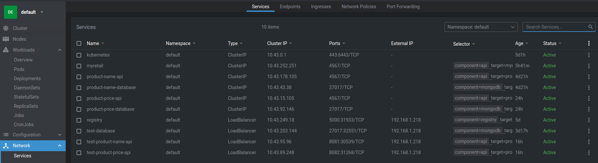
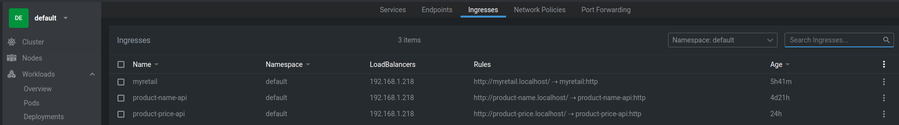

## MyRetail API Service

MyRetail is a rapidly growing company with HQ in Richmond, VA and over 200 stores across the east coast. MyRetail wants to make its internal data available to any number of client devices, from MyRetail.com to native mobile apps. 

## TLDR

```
# In terminal #1
# Deploy the Kubernetes cluster
./create_kubernetes_cluster.sh
```

```
# In terminal #2
# Deploy the project
rake deploy

# Run some basic tests
./test/create.sh
./test/list.sh
./test/update.sh
./test/read.sh
```

## What is this?

This project deploys the MyRetail API to a Kubernetes cluster. This REST API can be used to store and retrieve product information, including product names and prices, keyed by an id number.

## Requirements

- [x] Complete the excercise in the technical stack of your choice
  - [x] When appropriate use a data store of your choice
  - [x] Use any external frameworks you desire
  - [x] Be ready to discuss your recommendations to make your solution suitable for use in a production environment
- [x] Provide evidence of the result to the interviewers (Choose one)
  - [x] Unit test results or other documented output
  - [ ] Hosted instance of the implementation
  - [x] Runnable instance of the implementation on your computer
- [x] The end result should be a functional implementation of the problem with associated tests
  - [x] Provide the working code either in a publicly accessible hosted repository or a zip file containing all necessary build steps and dependencies
  - [ ] Rename .js files to .js.txt if emailing code
  - [x] Provide a README.md file with instructions for testing, running and interacting with your application and any details you feel are relevant to share

The goal for this exercise is to create an end-to-end Proof-of-Concept for a products API, which will aggregate product data from multiple sources and return it as JSON to the caller. 

Your goal is to create a RESTful service that can retrieve product and price details by ID. The URL structure is up to you to define, but try to follow some sort of logical convention.

Build an application that performs the following actions: 
- [x] Responds to an HTTP GET request at /products/{id} and delivers product data as JSON (where {id} will be a number

Example product IDs: 13860428, 54456119, 13264003, 12954218)
Example response: {"id":13860428,"name":"The Big Lebowski (Blu-ray) (Widescreen)","current_price":{"value": 13.49,"currency_code":"USD"}}

- [x] Performs an HTTP GET to retrieve the product name from an external API. (For this exercise the data will come from redsky.target.com, but let’s just pretend this is an internal resource hosted by myRetail) 

Example: 
https://redsky-uat.perf.target.com/redsky_aggregations/v1/redsky/case_study_v1?key=3yUxt7WltYG7MFKPp7uyELi1K40ad2ys&tcin=13860428

- [x] Reads pricing information from a NoSQL data store and combines it with the product id and name from the HTTP request into a single response

- [x] BONUS: Accepts an HTTP PUT request at the same path (/products/{id}), containing a JSON request body similar to the GET response, and updates the product’s price in the data store. 

## Dependencies

- You will need to have `curl`, `jq`, `ruby`, and `rake` available
  - On a Debian/Ubuntu system: `apt install ruby rake curl jq`
- You need to have Docker 20.04+ on your machine,
  - Make sure you can do `docker run --rm hello-world` successfully
- You will need root access to run `k3s` for setting up a Kubernetes cluster locally
- You need to ensure that nothing is already listening on ports `80` and `443`
- You need internet access to pull down dependent `docker` images

## Folder Structure

```
.                                   # Project Root
├── bin                             # k3s binary dependencies
├── build                           # All build artifacts for this project (gems and docker image tarballs)
├── config                          # k3s configuration
├── create_kubernetes_cluster.sh    # Script to spin up k3s
├── data                            # k3s cluster data
├── doc                             # Extra documentation and images for the README
├── dockerfiles                     # Dockerfiles used to build the project
├── output                          # Output files
│   ├── complete_build.txt          # `rake all`
│   ├── sanity_checks.txt           # `./test/test.sh`
│   └── unit_tests.txt              # `rake test`
├── Rakefile                        # Ruby-based Makefile for dependency management and running tasks
├── README.md                       # Documentation for the project
├── src                             # All source code for the project
│   ├── common                      # Common gems used by the main services
│   │   ├── database                # MongoDB wrapper
│   │   └── json_mixin              # Allows a Ruby class to emit JSON
│   ├── myretail                    # The main MyRetail API
│   ├── product_name                # An API for the Product Name database
│   └── product_price               # An API for the Product Price database
└── test                            # Extra test files

```

## Architecture

This project is implemented using 3 microservices:

- A user-facing REST API named `myretail`
- An internal `product-name` API used to map Product IDs to a human-readable name
- An internal `product-price` API used to store and retrieve prices of Product IDs

Both `product-name` and `product-price` are backed by MongoDB instances containing their respective data. `myretail` aggregates the results of the other two APIs and presents a unified view of them.



### MyRetail

This user-exposed API is designed to be a generic API aggregator, capable of combining data from multiple sources into a single presentation. It has support for the following operations:

- List
- Create
- Read
- Update
- Delete

### Product-Name / Product-Price

These services provide a way to retrieve a product name or price by its product ID number. Each service is responsible for it's one thing.

These two services are almost identical. Each provides CRUD operations into a MongoDB datastore. These services are not exposed externally.

The services themselves use Classes/Objects as an intermediate interface between the REST API endpoint and the backend datastore. These classes could be expanded to provide additional functionality if desired, such as input validation.

Splitting the Product-Name and Product-Price services was chosen due to the requirement that the product names come from an external source. Pointing the MyRetail service to an external Product-Name source is as simple as changing an environment variable.

## Building

This project is built entirely in Docker containers. Performing a `rake build` will build all the gems and Docker images needed to deploy the project, with all artifacts being stored inside the `./build` directory.

## Testing

All unit tests for the project are run inside of Docker containers. Performing a `rake test` will run the unit tests.

Some of the tests do rely on services being deployed. If they are not deployed, they will be skipped. To deploy the services required for testing, use `rake deploy_test` followed by `rake test`.

An example of this is running a test instance of a MongoDB database, for unit testing the Database client wrapper. However, the exact same tests are run against a `MockDatabase` class to prove that the behavior is the same, such that other tests can use the `MockDatabase` instead of a real one.

Unit tests are provided for both the internal operations as well as their publically-available API.

## Deployment

The services are all deployed to a local Kubernetes cluster managed by `k3s`. The script `create_kubernetes_cluster.sh` takes care of setting up the cluster.

`rake deploy` will build and deploy the Docker containers and Kubernetes manifests to the cluster. Each of the APIs is deployed with 2 replicas. `myretail` is deployed with an Ingress that allows you to access it at `http://myretail.localhost`, while the other two services are not publicly accessible by default (although if `rake deploy_test` is used, those services are also exposed so they can be hit directly)

The deployment will automatically deploy a Docker Registry to the cluster as well, and push the images to it. This is so k3s (running containerd) can access the images.

I highly recommend using [Lens](https://k8slens.dev/) to view the cluster after deployment. Below are some images of the services running in Kubernetes:

Pods:


Services:


Ingresses:


(Keep in mind that `rake deploy_test` was used here as well, to show the test services and ingresses in place)

## Out of Scope

### Authentication of the API

For this demo, no authentication is provided for the API. One way to handle this would be to use something like Authelia or Keycloak as an authentication proxy, and configure it in the Traefik reverse-proxy as a forwarder. This would be applied at the public ingress endpoint, and could use something like LDAP for authentication.

### Volume Persistence

This project is completely ephemeral. The data in the MondoDBs are not persisted betweeen deployments. If this were desired, the following would be needed:

- Persistent Volumes and Persistent Volume Claims
- Ideally, not just stored using `host` mode, but properly with something like GlusterFS to request dynamic block devices
- Replication to the other nodes (again, GlusterFS can handle this)
- A backup mechanism

### High Availability

This project is deloyed to a single-node Kubernetes cluster. As such, it is just a demonstration and not intended to be highly available. If this project were to be modified to be deployed in a highly available configuration, the following would be needed:

- 2+ more nodes added to the cluster
- Multiple MondoDB databases with replication
- Pod Affinity / Anti-Affinity scheduling configurations, to keep the microservices scheduled near their dependent databases, but spread across nodes

### Pagination

The APIs do not currently support pagination. For small datasets, this is fine. However, if this project were to be used for large datasets, things like the "list" function would end up being too expensive.

### Performance

A simplistic wrapper was put around the MongoDB client, in order to abstract the 3rd party dependency away. This wrapper is only concerned with behavioral correctness, and not with performance. For example, indices are not used. 

### Uniqueness of Products

The database also does not enforce uniqueness of product IDs.

### Input Validation

The services don't really do any input validation other than types. For example, a `currency` of `NOTAREALVALUE` would be accepted, where something like `USD` is more appropriate.

## Tools Used

- [Lens](https://k8slens.dev/)
- [yEd](https://www.yworks.com/downloads)

## Troubleshooting

If you have issues getting the Ingress to properly connect to the Service (indicated by `502 Bad Gateway` errors), try the suggestion here:

https://github.com/k3s-io/k3s/issues/1646

The solution is to add masquerading to the firewall:

`firewall-cmd --permanent --add-masquerade && firewall-cmd --reload`

Despite the `--reload`, I did find that I had to reboot my machine after applying this change.
